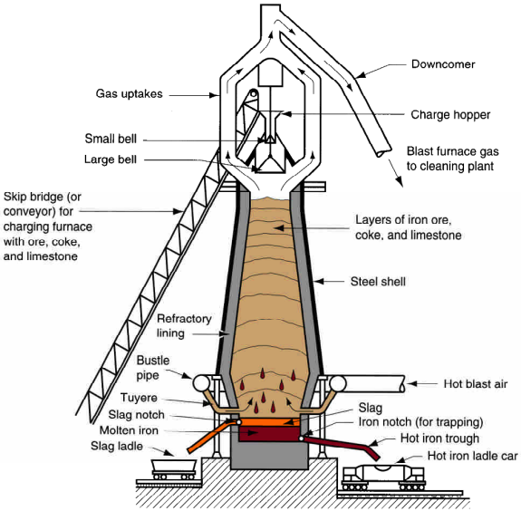
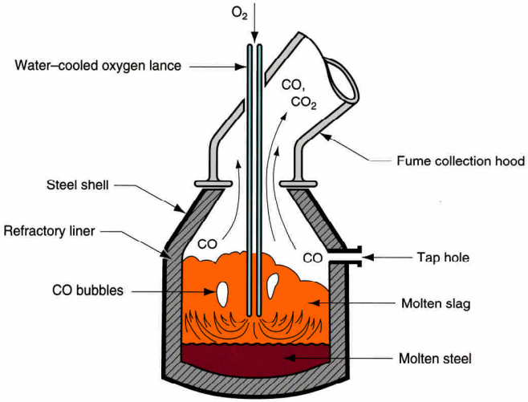
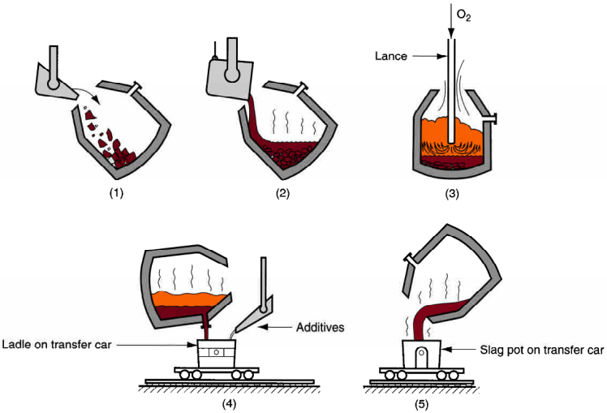
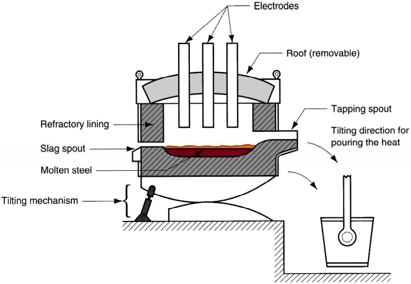
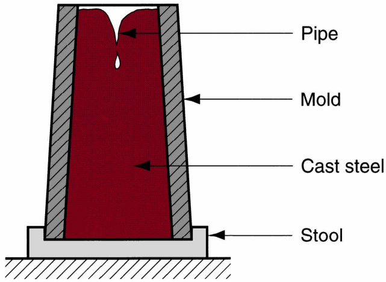
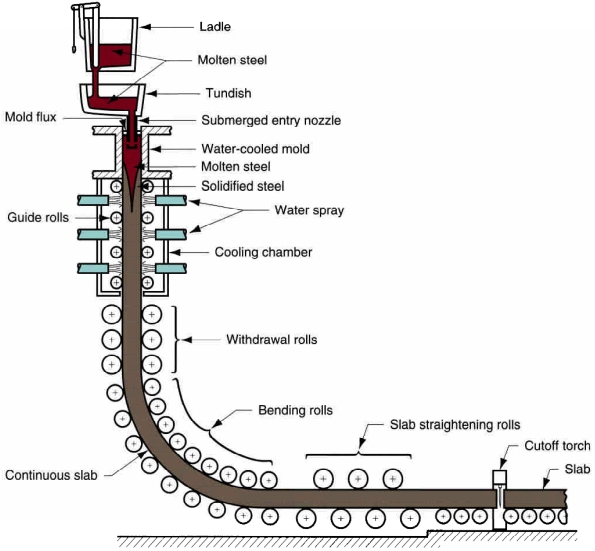
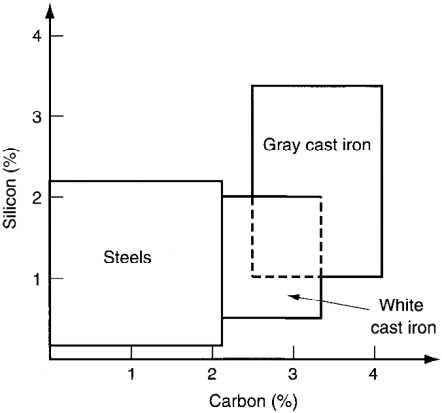

# Iron and Steel Production

Iron making: from iron ore
Steel making: refined from produce iron

## Blast Furnace, for Iron Making

1. Hot air is blasted at high rates
2. furnace is fed with iron ore, limestone and coke (which is coal)

## Basic Oxygen Furnace, for Steel Making

1. charging of scrap
2. charging of pig iron (the output of blast furnace)
3. blowing
4. tapping the molten steel
5. pouring off the slag

## Electric Arc Furnace, for Steel Making
Higher quality at a higher cost  

## Casting Process
### Casting of Ingots, discrete production

### Continuous Casting, semi-continuous

# Types of Irons and Steels
1. Steel, iron-carbon alloy with 0.02-2.1% carbon
    1. Plain Carbon Steels
        1. Low Carbon Steels <0.2% carbon
        2. Medium Carbon Steels 0.2% < carbon < 0.5%
        3. High Carbon Steels 0.5% < carbon
        - other elements are present in trace amounts
        - increased strenght, reduced ductility
        - can be heat treated to harden the steel
    2. Low Alloy Steels
        - superior mechanical properties (strenght, hardness, hot hardness, wear resistance, tougness)
        - such properties might require heat treatment
    3. Stainless Steels
        1. Austentitic Stainless, 18% Cr, 8% Ni
        2. Ferritic Stainless, 15-20% Cr, low C, No Ni
        3. Martensitic Stainless, <18% Cr, low C (higher than ferritic), No Ni
        4. Precipitation hardening stainless, 17% Cr, 7% NI, +small amounts of other alloying elements (Al, Cu, Ti, Mo)
        5. Duplex stainless, mixture of austenite and ferrite in roughly equal amounts
        - corrison resistance
            - mostly alloying element is chromium
            - nickel might be also used for increased resistance
            - high carbon content reduces corrison resistance undersirable 
        - significantly more expensive
        - high strenght and ductility
    4. Tool Steels
2. Cast Iron, iron-carbon alloy with 2.1-5% carbon  
    with 1-3% silicon (unlike steels), some types of cast iron though similar in composition vary due to processing treatments:
    1. gray cast iron
    2. ductile cast iron
    3. white cast iron
    4. malleable iront
    5. ...
    - suitable as casting metal  
    

# Desgnation Schemes AISI
1. 4-digit scheme YYXX
    - 10XX  
        Plain Carbon steel containing 0.XX% carbon
    - YYXX  
        Low Alloy Steels
        - YY alloying elements
        - XX carbon presence
2. 3-digit scheme XYY  
    for Stainless Steels
    - X inidcate general type
    - YY indicate specific grade
4. Letter Indicator  
    for Tools Steel
    - T, M High speed tooling (machinary cutting tools)
    - H hot working tool steels (die casting, ...)
    - D cold work tool steels (dies for sheet metal, ...)
    - w water hardening tool steels
    - S shock resistant tool steels (sheetmetal punching)
    - P Mold steels (molds for plastic and rubber)

# Non-Ferrous Metals
## Light Metals
### Aluminum
- High electrical and thermal conductivity
- corresion resistance
- very ductile
- relatively low strength

#### Designation
1. Wrought code YXXX
2. Cast code YXX.X
3. A dash can be appended to indicate treatments applied
where Y indicate the alloy group

### Magnesium
1. very light
2. easy to machine
3. soft and relatively weak

#### Designation
ABXYC
- A first metal
- B second metal
- X percent of first metal
- Y percent of second metal
- C variation indicator
- temper indication as aluminum

### Copper
- corrosion resistant
- thermally conductive
- excellent electrical conductive
- low strength and hardness

#### Desgnation of Unified Numbering System for Metals and Alloys (UNS)
CXYZMN
- C stands for copper

### Nickel
similar to iron
- Magnetic
- young's modulus similar to that of iron
- corrosion resistant

### Titanium
- Density between Al and Fe
- low cofficient of thermal expansion
- stronger than Al
- strenght not affected by high temperature
- reactive
- corrosion resistant

<!-- ### Zinc
- low melting point
- corrosion resistant

### Lead and Tin
- lead
    - dense
    - low melting point
    - low strenght
    - low hardness
    - high ductility
    - corrosion resistant

- Tin
    - very low melting point
    - low strength
    - low hardness
    - good ductility

### Refactory Metals
Maintain high strength at high temperatures
#### Tungesten
- highest melting point
- densest
- stiffest
- hardest
#### Molydenum
less intersting than tungesten

### Presious Metals

### Super Alloys
1. Iron-based
1. Nickel Based
1. Cobalt Based -->
