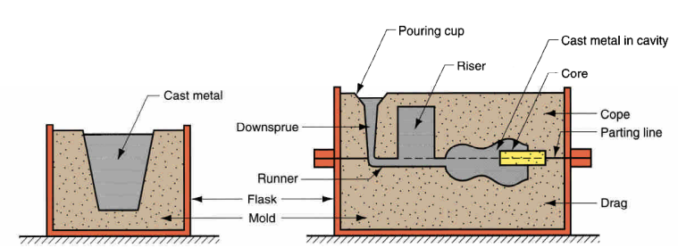
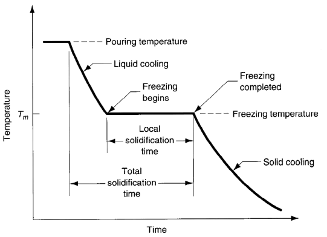
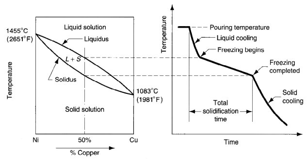
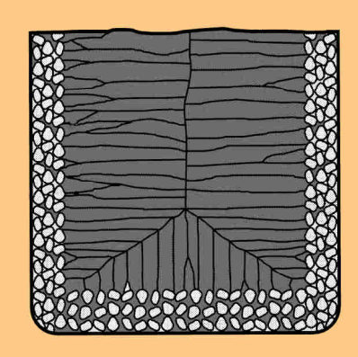
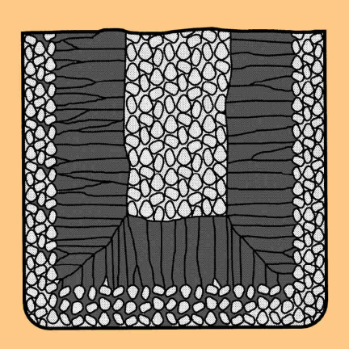
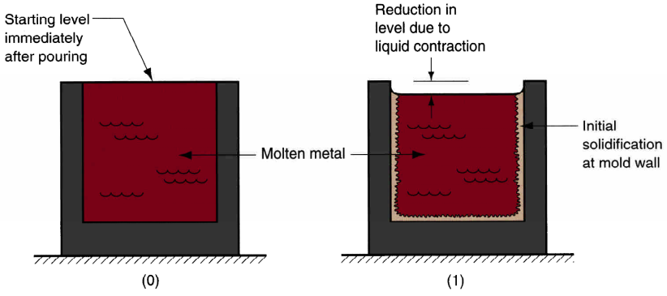
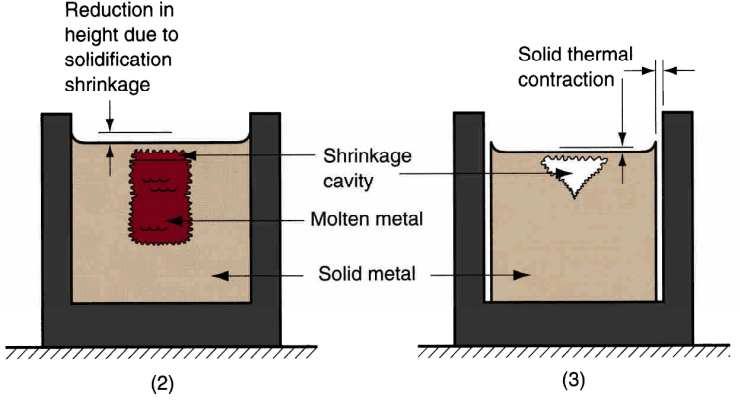
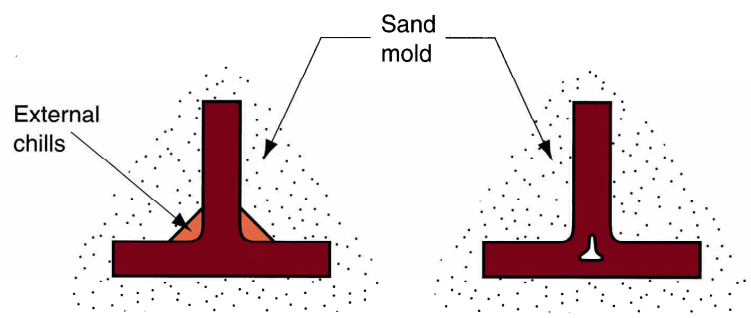

# Metal Casting Fundamentals

## Solidificaton Processes

starting material is either liquid or in a highly plastic condition

solidification can be classified according to the starting material:
1. casting of metals
    - expendable-mold casting
    - permananet-mold casting
2. glassworking
3. polymers and polymer matrix composites
    - ...

## Casting
A process in which molten metal flows by gravity or other force into a mold where it solidifes in the shape of the mold cavity.  
The term casting may also refer to the final product of the process.

### Advantages
1. can create complex geometris
2. can create both internal and external shapes
3. net-shape or near net-shape
4. can produce very large parts

### Disadvantages
1. limitations on mechanical properties
2. poor dimentional accuracy and surface finish for some processes (sand casting)
3. safety hazards due to molten metal
4. environmental problems

### Casting Molds
1. should be slightly oversized to allow metal shrinking during solidification and cooling
2. There's two types of molds, open mold (on the left), closed mold (on the right).
    
3. if sand is used as molding material it should be moist and contains a binder to maintain shape
4. cores determine the internal surfaces
5. riser (or reservoir) provides additonal metal material to compensate for shrinkage during solidification

### Categories of Casting Processes
1. Expendable Mold Process
    - more complex geometries are possible (the mold can be monolithic and not a group of combined open molds)
2. Permenant Mold Process
    - more economic for high production operations

### Steps of Casting
1. preparing the mold
2. heating the metal
    1. heat metal to melting point
    2. heat metal to change phase from solid to liquid (heat of fusion)
    3. heat molten metal to reach desired temperature for pouring
3. pouring the metal  
    factors that determine the success of this step:
    - pouring temperature
    - pouring rate
    - turbulence
4. solidification of metal  
    for pure metals  
      
    for metal alloys  
    

### Solidification
#### Pure Metals
1. due to chilling action of the mold wall, a thin skin of solid metal is formed at the interface immediately after pouring
2. skin thickness increases to form a shell around the molten metal as solidification progresses
3. freezing rate depends on heat transfer into mold, and thermal properties of the metal  

##### Characteristic grain structure
  

#### Metal Alloys
##### Characteristic grain structure
  

#### Solidification Time
Total Solidification Time is dependent on the size and shape of mold
$$TST = C_m\left(\frac{V}{A}\right)^n$$
where:
    - A is the surface area of the cast
    - V is the volum of the cast
    - $C_m$ is the mold constant, usually 2, depends
        - mold material
        - thermal properties of cast metal
        - pouring temperature relative to melting temperature

### Solidification Shrinkage
  

To counter solidification shrinkage:
1. the riser should freeze slower than the metal in the cast so that it can fill-in the emptyed volume, thus it should have a higher volumn to area ratio than that of the cast.
2. Oversize the shrinkage cast
    - known as pattern shrinkage allowance
    - casting dimensions are linear, so are is the allowance

### Directional Solidification
It's very desirable for the molten metal far from the riser to cool faster than that near the riser.  
The term "directional solidification" describe this aspect of freezing and methods by which it is controlled.

#### Achieving Directional Soldification
1. location section of low V/A rations away from the riser
2. add chills, internal or external heat sinks that cause rapid freezing.
3. using Chvorinov's rule determine the best design for the casting itself, orientation in the mold and the riser system

  