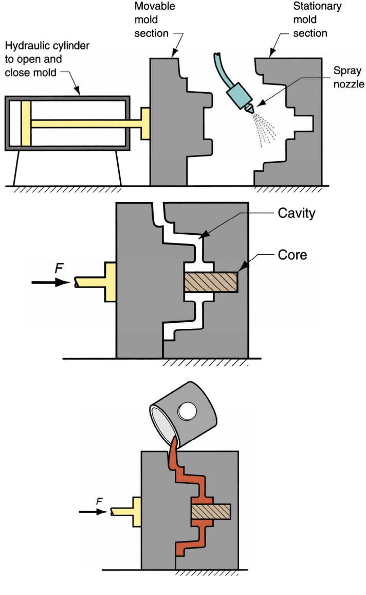

# Metal Casting Processes

## Sand Casting
### Steps
1. Pour molten metal into sand mold
2. allow metal to solidify
3. break up the mold and remove casting
4. clean and inspect casting
5. heat treatment of casting if needed

### Making the Sand Mold
1. cavity in the sand mold is formed by packing sand around a pattern
2. gating and riser systems are added
2. core is inserted if internal surfaces are needed
2. the mold is then separated into two halves
3. the pattern is removed

## Mold Pattern
### Pattern Materials
- Wood
    - easy to work with
    - wraps
- metal
    - expensive
    - last longer
- plastic
    - inbetween metal and wood

### Pattern Types
- solid pattern
- split pattern
- match-plate pattern
- cope and drag pattern

### Desirable Properties
- strength  
    to maintain shape
- permeability  
    allow gases to pass through voids in sand
- thermal stability  
    resist cracking upong contact with molten metal
- collapsibility
    ability to allow casting to shringk without cracking it
- reusability  
    broken mold sand can be reused

### Microstructure Effects on Properties
1. small grain size yields better surface finish
2. large grain size is more premeable
3. irregular grain shapes strengthen molds due to interlocking
4. regualr grain shapes increase premability

Addditive are used to tune the properties

## Buoynacy in Sand Casting Operation
It is a phenomena where core is displaced by molten metal (same phenomena that causes floatin on water), force trying to lift (displace) the core is equal to the difference between the weight of the displaced liquid and weight of the core itself.

## Other Expedable Mold Casting Processes
1. Shell Molding  
the mold is a thin shell of sand held together by thermosetting resin binder

    - Advantages
        1. better surface finish
        2. good dimensional accuracy
        3. can be mechanized for mass production
    - Disadvantages
        1. more expensive
2. Vaccum Molding  
uses sand mold held together by vaccum pressure, rather than chemical binder

    - Advantages
        - easy recovery of sand (no binders)
        - moisture-related defects are absent, since no water is mixed with sand
    - Disadvantages
        - slow process
        - can't be mechanized easily
3. Expanded Polystyrene Process  
uses a mold of sand packed around a polystyrene foam pattern which vaporizes when molten metal is poured into mold

    - Advantages
        - no need to remove pattern from mold
        - simplifies mold making (no halves are reqired)
        - can be incorporated into mass production
    - Disadvantages
        - a new pattern is needed for every casting
        - might not be economically justified
4. Investement Casting  
A pattern made of wax is coated with a refractory material to make mold, after which wax is melted away prior to pouring molten metal.  

    - Advantages
        - supports very complex parts
        - close dimentional control
        - good surface finish
        - wax is recoverable
        - additional machining isn't required usually
        - net shape process
    - Disadvantage
        - many processing steps are required
        - expensive

5. Plaster Mold  
similar to sand casting, but uses plaster of paris instead of sand
    - Advantages
        - good diemntional accuracy
        - good surface finish
        - capability to make thing cross-sections
    - Disadvantages
        - moisture in plaster mold
        - limited to low melting point metlals

6. Ceramic Mold Casting  
    similar to sand casting, but uses refactory ceramic materials that can withtand higher temperatures than plaster
        - Advantages
            - usable for high temperatures casts
            - good accuracy
            - good finish
            - capability to make thing cross-sections

## Permanent Mold Casting
Doesn't have the economic disadvantage of requiring a new mold after every cast.
1. Basic permanant mold casting
Uses a metal mold constructed of two sections designed for easy, precise opening and closing.

    - Advantages
        - good dimentional control
        - good surface finish
        - increased solidification rate (due to metal mold, result in finer grain structure, thus stronger results)
    - Disadvantages
        - limited to metals of low melting point
        - simple geometries because of the need to open the mold
        - high cost of mold
2. die casting
A permanent mold casting process in which molten metal is injected into mold cavity under high pressue.
    - Advantages
        - economical for large quantities
        - good dimentional accuracy
        - good surface finish
        - thin sections possible
        - rapid cooling
    - Disadvantages
        - limited to metals of low melting point
        - restricted geometries to allow mold halving
    - Types
        1. hot-chamber die casting
            
        2. cold-chamber die casting
            
3. centrifugal casting